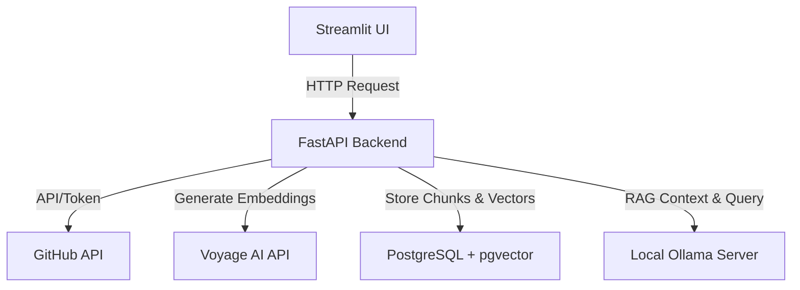

# RepoMind-AI

An Intelligent RAG-powered Codebase Search and Question-Answering Workspace for GitHub Repositories.

---

## Reproducibility Guide

You can run **RepoMind-AI** on your own local device. Follow these steps to clone the repository, spin up the database, run migrations, and start the application.

### Prerequisites
*   [Python 3.12+](https://www.python.org/downloads/)
*   [Docker Desktop](https://www.docker.com/products/docker-desktop/) (for PostgreSQL/pgvector and Redis)
*   [uv](https://github.com/astral-sh/uv) (fast Python package manager)
*   [Ollama](https://ollama.com/) (running locally)

### Step-by-Step Setup

1.  **Clone the Repository**
    ```bash
    git clone https://github.com/harveenkaur282-web/RepoMind-AI.git
    cd RepoMind-AI
    ```

2.  **Configure Environment Variables**
    Copy `.env.example` to `.env` and fill in your keys:
    ```bash
    cp .env.example .env
    ```
    Open `.env` and configure your API keys:
    ```env
    # Required for dense/hybrid embeddings
    VOYAGE_API_KEY=your_voyage_api_key_here
    
    # Required for private repos or higher GitHub API rate limits (recommended)
    GITHUB_TOKEN=your_github_token_here
    ```

3.  **Start the Databases (Docker)**
    Ensure Docker Desktop is open and run:
    ```bash
    docker-compose up -d
    ```

4.  **Run Database Migrations**
    Apply Alembic schema migrations:
    ```bash
    uv run alembic upgrade head
    ```

5.  **Pull the Ollama LLM Model**
    Make sure your local Ollama application is running, then pull the default model:
    ```bash
    ollama pull qwen2.5-coder:7b
    ```

6.  **Start the FastAPI Backend**
    ```bash
    uv run uvicorn backend.app.main:app --port 8000 --reload
    ```
    *(The API documentation will be available at `http://localhost:8000/docs`)*

7.  **Start the Streamlit Frontend**
    In a new terminal tab, run:
    ```bash
    uv run streamlit run frontend/streamlit/app.py --server.port 8501
    ```
    *(The user interface will be live at `http://localhost:8501`)*

---

## Problem & Motivation

Navigating and understanding a large or unfamiliar codebase on GitHub can be time-consuming. Developers frequently spend hours scanning files, parsing helper structures, and trying to trace API pathways. 

**RepoMind-AI** solves this by providing a local, RAG-powered (Retrieval-Augmented Generation) assistant that ingests entire GitHub repositories, parses documents using custom chunking strategies, stores them in a vector database (`pgvector`), and answers queries locally using Ollama.

---

## Main Features

*   **Repository Ingestion**: Ingest any public (or private, via GITHUB_TOKEN) repository directly by inputting `owner/name`.
*   **Incremental Repository Updates**: Uses Git blob SHA comparisons to sync remote files. It skips unchanged documents to avoid redundant chunking and embedding (saving cost and time), processes modified/new files, and cleans up deleted documents.
*   **Hybrid Search with RRF**: Offers three search strategies:
    *   **Dense**: Semantic vector similarity matching.
    *   **BM25**: Sparse keyword term matching.
    *   **Hybrid**: Reciprocal Rank Fusion (RRF) combining dense and sparse ranks.
*   **Deduplicated Context Assembly**: Cleans, deduplicates, and formats retrieved code blocks while enforcing token boundaries to fit local LLM context windows.
*   **Local LLM Generation**: Uses local Ollama servers (defaulting to `qwen2.5-coder:7b`) to maintain code privacy.
*   **Developer Mode**: A dedicated diagnostics dashboard for inspecting database row metrics, testing LLM ping latency, and comparing retrieval strategies side-by-side.

---

## Architecture & RAG Flow

The application follows a decoupled client-server architecture:



### Retrieval-Augmented Generation (RAG) Flow:
1.  **Ingestion & Chunking**: Remote repository files are parsed using a `document_aware` chunker, generating embeddings via the Voyage API, and storing chunks as vectors in PostgreSQL.
2.  **Query & Embedding**: The user enters a question in Streamlit. If using dense/hybrid search, the query is embedded via the Voyage API.
3.  **Context Matching**: `RetrievalService` runs the selected strategy (dense, BM25, or hybrid) to gather relevant code chunks.
4.  **Context Assembly**: Chunks are deduplicated, sorted, formatted with file path headers, and token-capped.
5.  **LLM Chat Generation**: The prompt is sent to the local Ollama server, which generates the code explanation.
6.  **Response rendering**: Streamlit displays the final response and attaches the source code chunks in clean, expandable code windows.

---

## Tech Stack

*   **Frontend**: Streamlit
*   **Backend**: FastAPI (Python 3.12)
*   **ORM**: SQLAlchemy (Async Engine)
*   **Database**: PostgreSQL with `pgvector`
*   **Cache/Queue**: Redis (ready for future task queueing- only FUTURE right now-)
*   **Embeddings**: Voyage AI (`voyage-code-3`, 1024 dimensions)
*   **Local LLM**: Ollama (`qwen2.5-coder:7b`)
*   **Migrations**: Alembic
*   **Linter/Formatter**: Ruff

---

## Evaluation & Future Improvements

### Current Status
*   Retrieval strategies are fully implemented (dense, BM25, hybrid).
*   FastAPI endpoints have mock tests validating RAG services, retrieval scoring, context assembly limits, and Ollama exception handlers.

### Planned Evaluation
*   **Retrieval Evaluation**: Setting up a ground-truth dataset of queries and relevant code snippets to calculate Hit Rate and Mean Reciprocal Rank (MRR) across Dense, BM25, and Hybrid strategies.
*   **LLM Evaluation**: Grading Ollama answers using a LLM-as-a-judge paradigm (measuring answer correctness, groundness, and compliance).
*   **Reranking**: Implementing a Cohere or local Cross-Encoder reranking step between retrieval and context assembly.

### Known Limitations
*   **GitHub Rate Limits**: Unauthenticated ingestion hits a 60 request/hour ceiling. Passing a `GITHUB_TOKEN` increases this to 5,000 requests/hour.
*   **Ollama Speed**: Local generation speed depends on your local GPU/CPU hardware.

---

## 🧪 Testing & CI

To run all unit tests locally:
```bash
uv run pytest backend/tests/test_repositories.py backend/tests/test_repository_ingestor.py backend/tests/test_rag_endpoint.py backend/tests/services/ -k "not integration"
```

To run formatting and lint checks:
```bash
uv run ruff check
uv run ruff format --check
```
