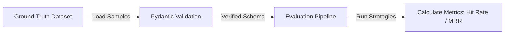

# Retrieval Evaluation Module

This module defines schemas and data structures for calculating RAG retrieval quality metrics.

---

## Evaluation Flow

---

## Components

### 1. Pydantic Models (`models.py`)
Ensures strict validation of dataset schemas:
*   `EvaluationSample`: Holds ground-truth fields for a single test query (question, target documents, matched code snippet chunks, category type, difficulty level).
*   `EvaluationDataset`: Holds version information and arrays of samples.

### 2. Versioned Dataset (`evaluation/data/`)
JSON datasets containing manually verified codebase queries mapping directly to RepoMind's files.
*   File: `evaluation/data/retrieval_dataset_v1.json`

### 3. Verification Tests (`backend/tests/evaluation/`)
Asserts schema loading and validation exceptions.
*   File: `backend/tests/evaluation/test_evaluation_dataset.py`
