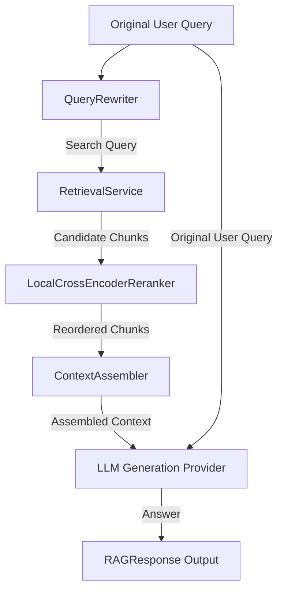

# RAG Services Module

This module orchestrates Retrieval-Augmented Generation (RAG) query pipelines, prompt strategies, query rewriting, and candidate reranking.

---

## Architecture & Data Flow

---

## Components

### 1. RAG Service (`service.py`)
Coordinative entrypoint invoking query rewriting, database retrieval, local cross-encoder reranking, deduplicated context building, and final LLM token generation.

### 2. Prompt Strategies (`prompts.py`)
Defines 3 distinct prompt templates to control generation tone:
*   `concise_grounded`: Answers queries concisely relying solely on provided code context.
*   `detailed_grounded`: Comprehensive technical details for developers.
*   `developer_assistant`: Senior developer assistant citing file paths and distinguishing evidence from inference.

### 3. Query Rewriter (`rewriter.py`)
Leverages the LLM provider to rewrite vague/conversational user queries into high-density, search-optimized technical tokens for codebase search.

### 4. Reranker (`reranker/`)
Modular document/chunk reranking layer:
*   `base.py`: Defines the `Reranker` protocol interface.
*   `local.py`: Implements a lightweight `LocalCrossEncoderReranker` scoring candidate relevance via token/sub-token matches (splitting CamelCase/snake_case) and directory path overlap.
